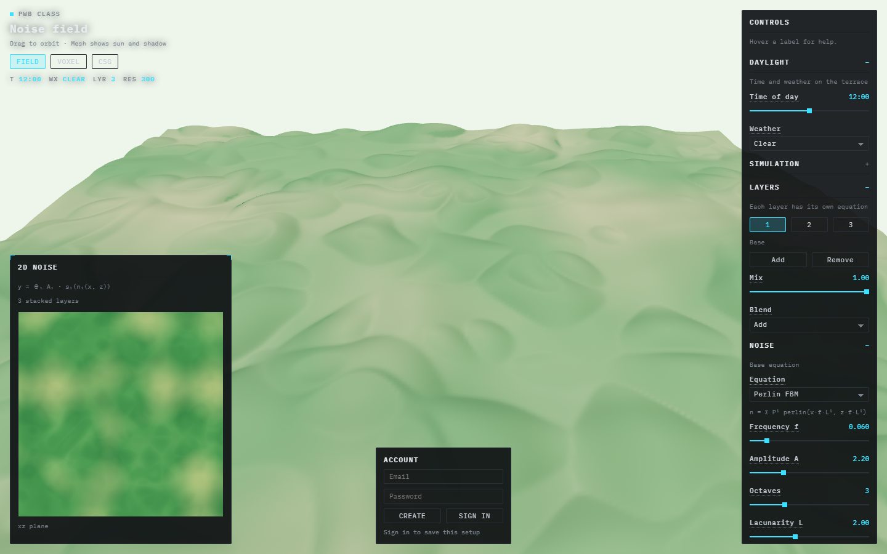

# React

[All areas](../../README.md)

React is the page. In this project it owns the title, the Field / Voxel / CSG tabs, the sliders, and the account box. It does not own the terrain mesh. That is Three.js, in the next folders.

## What I learned

React is not a program you double-click. The tools are:

| Tool | Job |
|---|---|
| Node.js | Runs JavaScript outside the browser |
| npm | Downloads packages |
| Vite | Creates the project and serves it while you edit |

The app was created in its own folder, not mixed into the markdown notes:

```powershell
cd C:\Users\asus\Documents\GitHub\PWB_class_02
npm create vite@latest my-react-app -- --template react
cd my-react-app
npm install
npm run dev
```

`npm run dev` starts a local site at [http://localhost:5173](http://localhost:5173). Saving a file in `src/` updates the browser. `Ctrl + C` stops the server. Closing the terminal does the same thing: the site only exists while that command is running.

## Example

This is the app after that install, once the terrain and the HUD were added. The page chrome (title, tabs, panels) is React.



## Full notes

Install, the command line, the folder list, and the usual errors: [Installing React](Installing%20React.md).

Next: [Three.js](../03-threejs/README.md).
