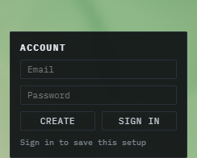

# Firebase

[All areas](../../README.md)

The terrain runs in the browser. Closing the tab used to throw the sliders away. Firebase is the backend that keeps an account and a saved setup without renting a server.

## What I learned

The first exercise was **Firestore** only: create a project, register the web app, start a database in test mode, put the config in `.env.local`, and write one note with `addDoc`. Authentication, Storage, and Hosting were left off on purpose. The old Realtime Database (`firebase.database()`) is the wrong product.

The app now uses three products:

| Product | What this app does with it |
|---|---|
| Authentication | Email and password. Create and Sign in |
| Firestore | Saves the current slider setup under that user |
| Hosting | The public site at [pwb2026-3cb0f.web.app](https://pwb2026-3cb0f.web.app) |

`src/firebase.js` calls `initializeApp` once and exports `auth`, `db`, and `storage`. The account box is `AccountPanel.jsx`. Saved setups go through `userData.js`.

The web `apiKey` is not a password. It ships in the browser. Security rules decide who can read and write. A downloaded service-account JSON **is** a secret and does not belong in `src/`.

Two failures from the sign-in session, in the order they happened:

1. `auth/api-key-not-valid` — one wrong character in the key copied into `.env.local`. The Hosting site kept failing after the local file was fixed, because the published JavaScript still had the old key. It had to be built and deployed again.
2. `auth/configuration-not-found` — the key was accepted, and Email/Password had never been enabled in the console.

## Example

The account box sits at the bottom center of every scene. Signed out, it asks for an email and a password. Signed in, it lists saved setups and can restore one onto the sliders.

The same box on the Field tab, in place over the terrain:

## Full notes

| Note | What it answers |
|---|---|
| [Firestore tutorial](0916_Firebase.md) | First project, test-mode rules, one saved note |
| [Session log](../sessions/0916_Vexel&Firebase.md) | The sign-in errors and the Hosting URL |

Config stays in `my-react-app/.env.local`. Restart `npm run dev` after editing it. Vite reads that file only at startup.
