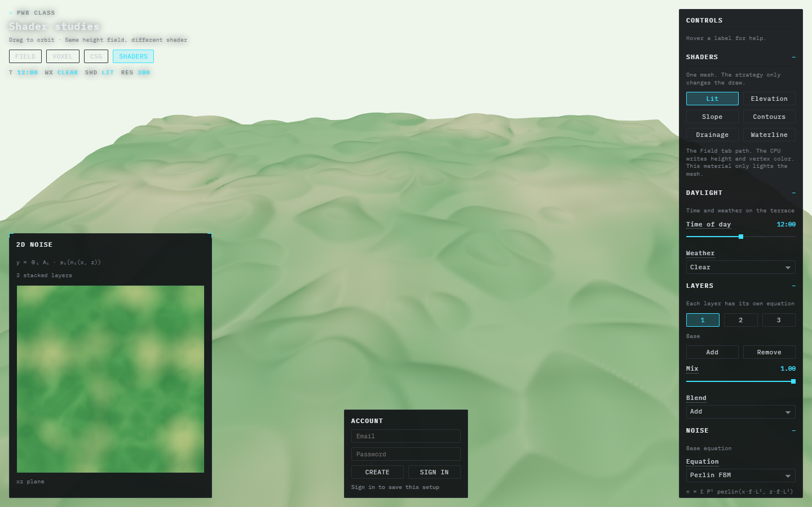
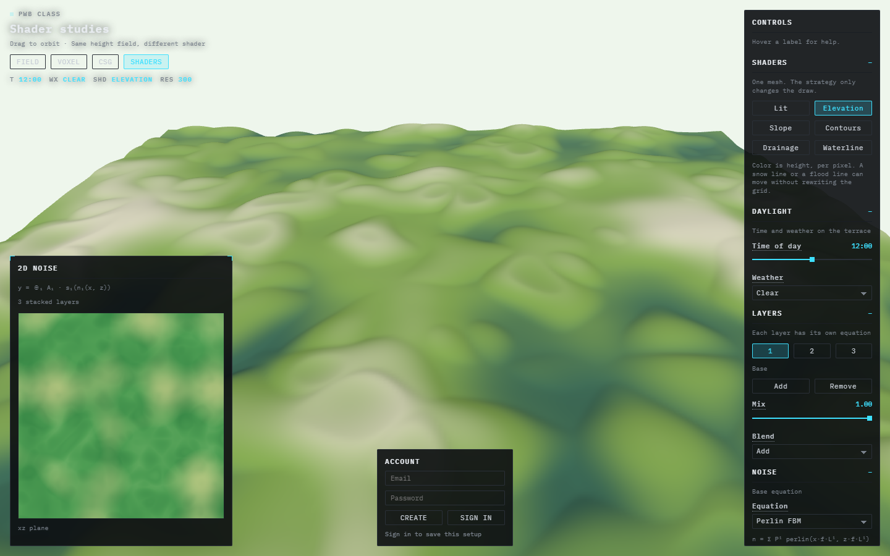
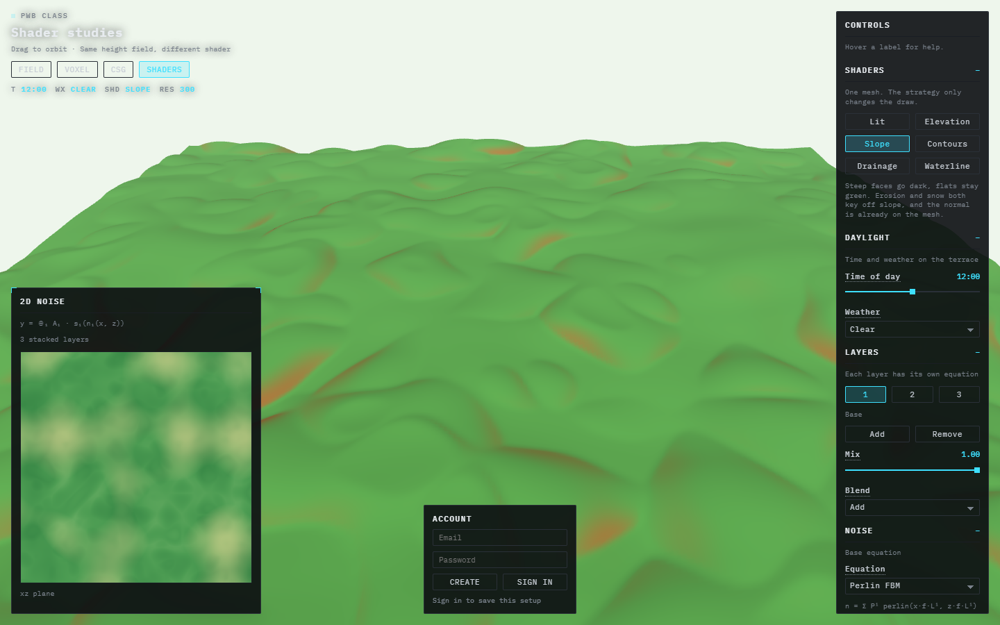
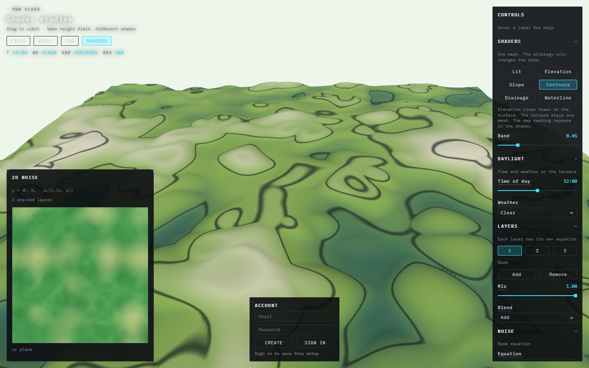
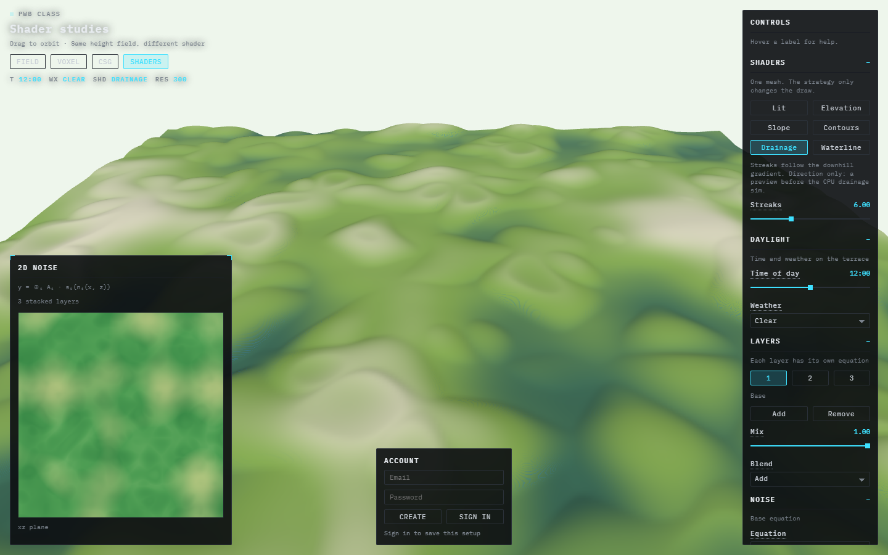
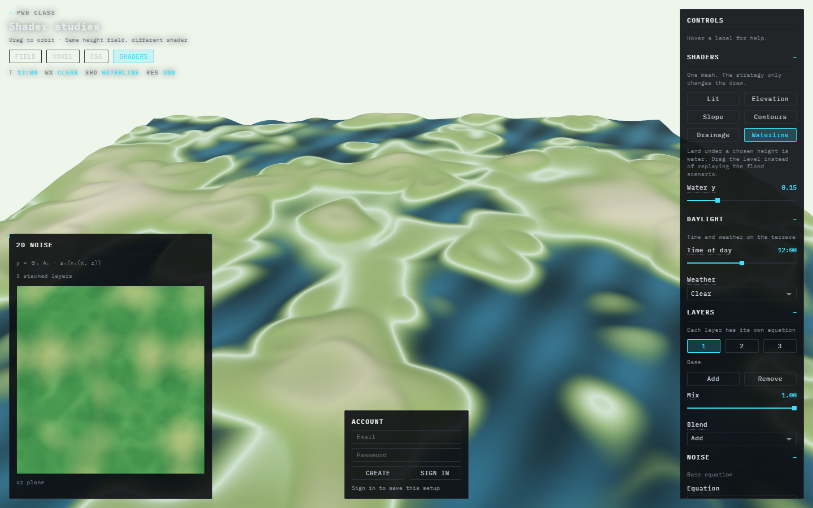

---
aliases:
  - Shader studies
tags:
  - pwb
  - shaders
date: 2026-09-29
---

# Shader studies

[All areas](../../README.md)

Open the app and choose **Shaders**, or go to [http://localhost:5173/#shaders](http://localhost:5173/#shaders).

The height field is still built on the CPU in `noise.js`. These shaders do not replace that. They decide how the finished surface is drawn. The mesh stays one plane. The buttons only swap the material.

Code: `my-react-app/src/shaders.js`, `ShaderCanvas.jsx`.

## What a shader can do for these simulations

The Field tab writes a height and a color onto every vertex, then asks the GPU to light that mesh. Fire, flood, snow, and erosion all do their work by painting those vertex colors again. That is a full walk of the grid every time the picture should change.

A shader runs per pixel, after the grid exists. It can recolor, draw lines, and animate from data the mesh already has: height, and the normal. Moving a flood line or a contour spacing does not rebuild the terrain. The 2D map and the voxel view keep using the same height function.

What it cannot see: how much water has already flowed through a cell, or which cells a fire has reached. Those are accumulated by `eventSim.js`. A shader can show the local slope and the downhill direction. It cannot invent the history.

## Strategies

**Lit** is the Field tab path. Vertex colors come from the CPU. The material only lights them. This is the baseline the other five replace.

**Elevation** colors by height in the fragment shader. Peaks go pale, valleys go dark green. Snow and flood both care about a height line. That line can move as one number, without rewriting colors on the grid.

**Slope** colors by how far the normal tilts off vertical. Flats stay green. Steeper faces go orange. Hydraulic erosion cuts steep ground and drops sediment on flats. Snow sticks on gentle slopes. The normal is already on the mesh after the height write, so this reading is free.

**Contours** draw an elevation line every `Band` of world height, with a heavier line every fifth band. The terrace shape op already steps the mesh. Contours let you read those steps the way a map does, still as one surface.

**Drainage** sends streaks downhill. The uphill direction is the xz part of the normal, so downhill is the opposite. The streaks move over time. This is direction only. It is not the D8 accumulation in the hydraulic scenario, which counts how much water passed through each cell. Use the streaks as a preview, then run that sim when you need the amount.

**Waterline** paints everything under `Water y` as water, with a bright shore where the surface crosses that height. The flood scenario fills valleys by resimulating and repainting vertices. Here the level is a slider. Drag it. The grid is not rebuilt.

## What I would develop next

| Shader | Why this one | Why not yet |
|---|---|---|
| Snow from slope and height | The snow sim already knows elevation and steepness. One `simTime` uniform could lay snow on the GPU instead of recoloring the grid each frame | The current sim also tracks a snow pack that melts and slides. That state still belongs in `eventSim.js` |
| Flood depth, not one water height | A real flood is deeper in the valley than on the bank. The shader would read a per-vertex depth written by the flood sim | The waterline above is one number for the whole mesh. It cannot pool in separate basins |
| Flow amount | Darker streaks where more water has passed | The normal only knows the direction. Amount is the CPU drainage pass |

I would leave the height simulation on the CPU. The layers, the blends, and the grid sims (Gray–Scott, erosion, waves) are easier to inspect there, and the voxel view and the 2D map sample the same function. The shader's job is the reading of a surface that already exists.
