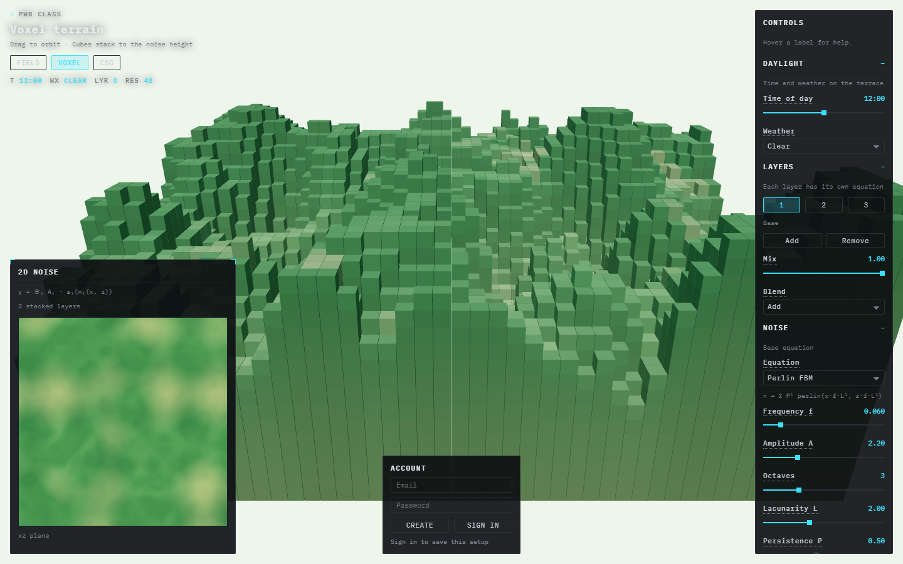
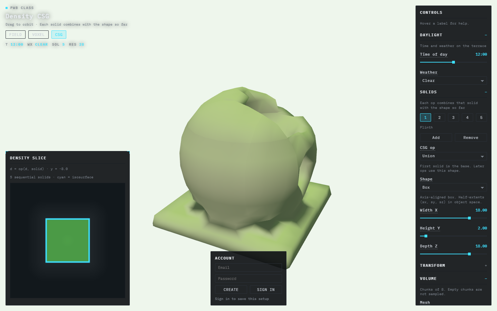

# Study notebook

This repository is the class notebook for a procedural terrain app. React draws the interface. Three.js draws the land. Firebase stores an account and a saved setup.

Start on this page. Each row opens one research area. The longer write-ups sit in that folder, next to a short `README` that says what the area is and shows an example.

## Table of contents

| | Area | What it covers | Open |
|---|---|---|---|
| 01 | Git and GitHub | Save versions, push this project | [Git and GitHub](NOTEBOOK/01-git-and-github/README.md) |
| 02 | React | Node, npm, Vite, the local server | [React](NOTEBOOK/02-react/README.md) |
| 03 | Three.js | Put the 3D library into the app | [Three.js](NOTEBOOK/03-threejs/README.md) |
| 04 | React and Three.js | HUD versus canvas, the frame loop | [React and Three.js](NOTEBOOK/04-react-and-threejs/README.md) |
| 05 | Noise field | Layers, daylight, weather, simulations | [Noise field](NOTEBOOK/05-noise-field/README.md) |
| 06 | Voxel, CSG, meshing | Cubes, density, chunks, marching cubes | [Voxel and CSG](NOTEBOOK/06-voxel-csg-meshing/README.md) |
| 07 | Firebase | Firestore, sign-in, saved setups, hosting | [Firebase](NOTEBOOK/07-firebase/README.md) |
| 08 | Interface | Dark HUD, small type, one accent | [Interface](NOTEBOOK/08-interface/README.md) |
| 09 | Shader studies | Swap draw strategies on the height field | [Shader studies](NOTEBOOK/09-shaders/README.md) |

Session log, including the sign-in debugging: [16 September](NOTEBOOK/sessions/0916_Vexel&Firebase.md).

## Run the app

From `my-react-app`:

```powershell
npm install
npm run dev
```

Open [http://localhost:5173](http://localhost:5173).

| Hash | Scene |
|---|---|
| `#field` | Smooth height mesh |
| `#voxel` | The same height, as stacked cubes |
| `#csg` | Sequential density solids, meshed |
| `#shaders` | Same height field, swappable shaders |

The published copy is [https://pwb2026-3cb0f.web.app](https://pwb2026-3cb0f.web.app). A local `.env.local` change does not update that site until the app is built and deployed again.

## Folder map

```text
PWB_class_02/
  README.md                 ← this page
  NOTEBOOK/
    01-git-and-github/      versions and GitHub
    02-react/               Node, Vite, first app
    03-threejs/             npm install three
    04-react-and-threejs/   how the two libraries split the work
    05-noise-field/         height field, process, file map
    06-voxel-csg-meshing/   cubes, CSG, chunking, marching cubes
    07-firebase/            database, account, hosting
    08-interface/           HUD style guide
    09-shaders/             shader strategies on the height field
    screenshots/            images used by the notes
    sessions/               class session log
  my-react-app/             the Vite project
```

Obsidian still finds a note by its title (`[[Noise field]]`, `[[Process]]`, `[[STYLE GUIDE]]`). The links on this page are normal paths, so the same notebook opens on GitHub.

## The scenes

Field is the default. Noon, clear weather, three stacked noise layers. The map at the lower left is the same height function drawn flat. The panel on the right is the HUD. The box at the bottom is the Firebase account.


Voxel keeps that height function and draws it as cubes. Resolution here is 48.



CSG leaves the height field. Five solids combine in order (union, subtract, intersect). The slice at the left is one horizontal cut through the density. Cyan is the isosurface the mesh is built from.



Shaders keeps that same height field and only changes the draw. Contours, slope, drainage, and a waterline are in [Shader studies](NOTEBOOK/09-shaders/README.md).


